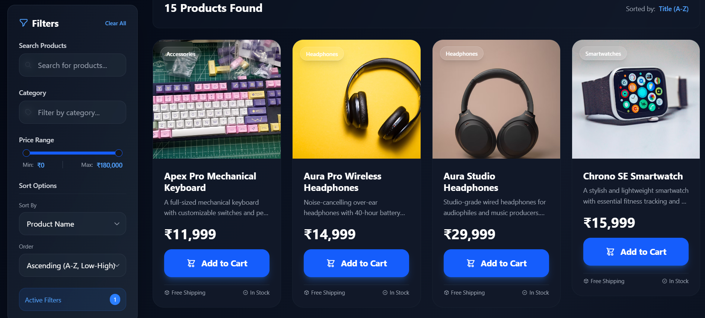
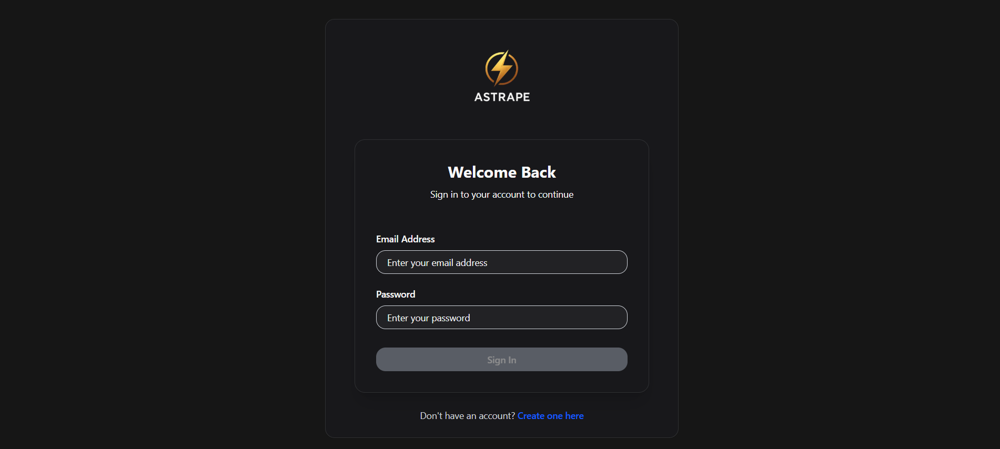
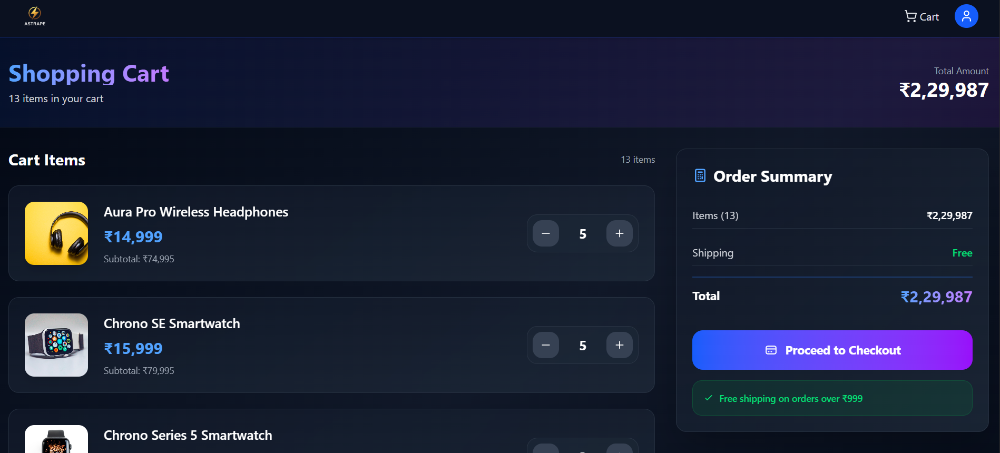
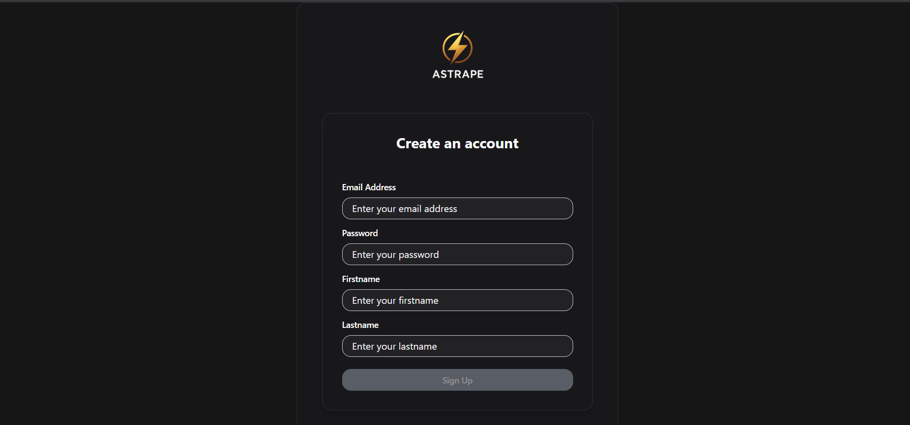

# ⚡ Astrape

**Astrape** is a modern **tech gadget e-commerce store** built with **Next.js**, featuring full user authentication, powerful product filters, and a dynamic cart system. Designed with a sleek **dark blue theme** using ShadCN UI, Astrape provides a smooth and engaging shopping experience across all devices.

## 🚀 Features

- **User Authentication** — Sign up & log in with form validation (`react-hook-form` + `zod`).  
- **Product Listing with Filters** — Search, sort, filter by category, and set price range (ShadCN Slider).  
- **Responsive Filters** — Sidebar for desktop, collapsible sheet for mobile.  
- **Cart with Real-Time Updates** — Add/remove products, update quantities, and sync with backend.  
- **Stock-Aware Controls** — Plus icon hides automatically when max stock is reached.  
- **Modern UI** — Fully responsive design with Tailwind + ShadCN and gradient dark theme.  

---

## 🛠️ Tech Stack

| Layer            | Technologies                                                  |
|------------------|---------------------------------------------------------------|
| Frontend         | Next.js, React, Tailwind CSS, ShadCN UI                       |
| Backend          | Node.js, Express, Prisma ORM, PostgreSQL                      |
| State Handling   | React Hooks (`useState`, `useEffect`), Context API (auth)     |
| Forms & Auth     | `react-hook-form`, `zod` (validation), JWT-based auth         |
| Deployment       | Vercel (frontend), Railway/Heroku (backend), PostgreSQL DB    |

---

## 🖼️ Screenshots

### 🔹 Landing Page (Products with Filters)

### 🔹 Filters Sidebar & Mobile Sheet

### 🔹 Cart Page with Quantity Updates

### 🔹 Authentication (Login / Signup)

---

## ⚡ Getting Started

### 🔧 Prerequisites

- Node.js (v16+)  
- PostgreSQL  

## Installation
- git clone https://github.com/Shreyansh-32/Astrape.git
- cd Astrape

# Backend
- cd backend
- pnpm install
- npx prisma migrate dev
- npm run dev

# Frontend
- cd ../frontend
- pnpm install
- npm run dev

## Contact
- Shreyansh Thakur
- 📧 thakurshreyansh0609@gmail.com

- 🔗 GitHub: github.com/Shreyansh-32